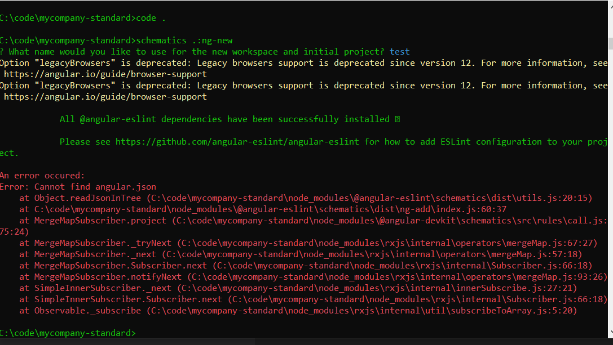

# Attempted schematic to create common install with predefined config

```
schematics .:ng-new
```
 

 ## Issues:
 - Is it possible to change folder "context" so things like EsLint's add-new can just work (they seem to need to be IN the new angular app I am creating in the first step)
 - Find how to switch to Yarn 2. Do we need "pre" step or process to install a bunch of things (ng cli, yarn, etc.)


 # Current failure point: 




#Steps to make this work from a fresh clone of the repo

1) Part of your problem is that you're trying to run a schematic without an Angular project
2) The idea behind schematics are to have an existing Angular project and make modifications
3) Technically your schematic will work inside an Angular project, but it also creates another Angular project inside the Angular project

ng new some-proj
cd some-proj
npm link ../mycompany-standard      NOTE(This is just temporary for quickly being able to run your schematics. You would package your schematic up into an npm package for actual use.)
ng g mycompany-standard:ng-new
